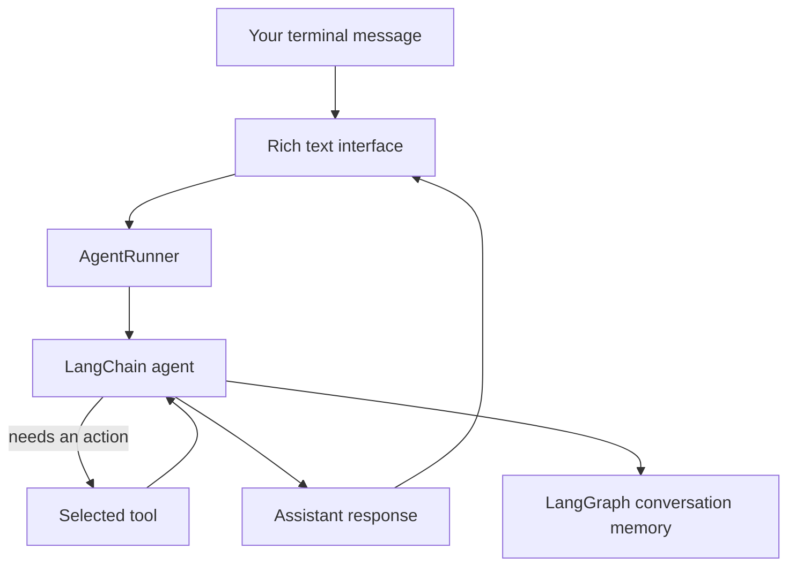

Hello Friend

Local personal AI assistant built with LangChain + LangGraph.

Runs in the terminal and automatically chooses tools for apps, browser actions, calculations, web research, weather, and sports.

# Hello Friend

Hello Friend is a small personal AI assistant that runs in your terminal. You can talk to it normally, and its language model chooses when to answer directly and when to use a tool on your behalf.

It can do calculations, open websites, search Google or YouTube, launch desktop applications, research the live web, retrieve weather, and look up football scores.

The project is deliberately simple: each part has one job, tools are ordinary Python functions, and the model provider can be changed without changing the agent.

## What happens when you send a message?



For example, when you ask `What is the weather in London?`:

1. The terminal sends your message to the agent.
2. The model recognizes that current information is needed.
3. It selects the `search_weather` tool.
4. The tool calls `wttr.in` and returns the weather data.
5. The model explains the result in a natural response.

The model is responsible for choosing tools. The Python tool implementation is responsible for performing the actual action and reporting whether it succeeded.

## Features

- Terminal chat interface powered by Rich.
- Groq, Ollama, and NVIDIA model providers.
- Conversation context during the current application run.
- Safe mathematical expression evaluation with `numexpr`.
- Browser actions for websites, Google, and YouTube.
- Cross-platform application launching and closing.
- Live web search through DuckDuckGo HTML results.
- Webpage fetching and readable HTML text extraction.
- Current news, weather, and football score tools.
- Clear separation between the interface, agent, models, memory, and tools.

## Project layout

```text
src/hello_friend/
├── __main__.py          # python -m hello_friend entry point
├── main.py              # alternate entry point
├── agent/
│   ├── agent.py         # creates the LangChain agent
│   ├── graph.py         # runs the agent and preserves thread history
│   ├── prompt.py        # behavior and tool-selection rules
│   └── state.py         # reserved for future custom state
├── core/
│   ├── config.py        # .env and environment settings
│   ├── logging_setup.py # Rich logging configuration
│   └── runtime.py       # application startup and shutdown
├── interface/
│   └── text.py          # terminal input and output
├── llm/
│   ├── model.py         # provider selection
│   └── providers/       # Groq, Ollama, and NVIDIA integrations
├── memory/
│   └── checkpointer.py  # LangGraph in-memory checkpointing
└── tools/
    ├── math/            # calculator
    ├── browser/         # browser actions
    ├── system/          # desktop application actions
    └── web/             # search and live information
```

## Requirements

- Python 3.11 or newer
- An API key for Groq or NVIDIA, or a local Ollama installation
- Internet access for web, weather, news, and sports tools

## Installation

Create and activate a virtual environment:

```powershell
python -m venv .venv
.venv\Scripts\activate
```

Install the project in editable mode:

```powershell
pip install -e .
```

On macOS or Linux, activate the environment with:

```bash
source .venv/bin/activate
```

## Configuration

Create a `.env` file in the project root. Choose one provider.

### Groq

```env
LLM_PROVIDER=groq
GROQ_API_KEY=your-groq-api-key
GROQ_MODEL=llama-3.3-70b-versatile
```

### Ollama

Make sure Ollama is running locally, then use:

```env
LLM_PROVIDER=ollama
OLLAMA_MODEL=gpt-oss:20b
OLLAMA_BASE_URL=http://localhost:11434
```

### NVIDIA

```env
LLM_PROVIDER=nvidia
NVIDIA_API_KEY=your-nvidia-api-key
NVIDIA_MODEL=meta/llama-3.1-70b-instruct
```

Optional shared settings include:

```env
LLM_TEMPERATURE=0.4
LLM_MAX_TOKENS=1024
APP_NAME=Hello Friend
LOG_LEVEL=INFO
```

Settings are loaded and validated in `src/hello_friend/core/config.py`.

## Run

```powershell
python -m hello_friend
```

Example conversation:

```text
> open youtube
> open calculator
> what is 25 * 17?
> what is the weather in London?
> find today's football scores
> my name is Alex
> what is my name?
Alex
> exit
```

You can also stop the program with `quit` or `:q`.

## Tools

Every tool uses LangChain's `@tool` decorator. The decorator exposes the function name, description, and argument schema to the model. The complete list is assembled in `src/hello_friend/tools/all.py`.

### Calculator

`calculator(expression)` evaluates arithmetic and mathematical expressions with `numexpr`. It does not use Python's unrestricted `eval()`.

### Browser tools

- `open_browser()` opens the default browser at Google.
- `open_website(url)` opens a specific website.
- `search_google(query)` opens Google search results.
- `search_youtube(query)` opens YouTube search results.

### System tools

- `open_application(name)` launches applications such as Calculator, Notepad, Paint, PowerShell, and File Explorer. It can also find executables on the system path.
- `close_application(name)` closes an application using the operating system process tools.

### Web tools

- `web_search(query)` returns up to five DuckDuckGo search results.
- `fetch_webpage(url)` returns raw webpage content, limited to about 12,000 characters.
- `extract_content(url)` extracts readable text from an HTML page, limited to about 9,000 characters.
- `search_news(query)` searches for recent news about a topic.
- `search_weather(location)` retrieves current weather from `wttr.in` without an API key.
- `search_sports(query)` retrieves current football scores from ESPN's English league scoreboard.

## Conversation memory

LangGraph stores messages using an `InMemorySaver` and a `thread_id`. Hello Friend currently uses the thread ID `default`.

This gives the assistant context while the program is running, but the history is lost when the process exits. A database-backed persistent memory system is planned.

## Safety notes

The agent is instructed to open or close applications only when explicitly asked. However, the current system does not have a separate approval or policy layer.

Be especially careful with `close_application`, because closing a program can discard unsaved work. File operations, shell commands, and other powerful computer-control tools should be protected by confirmation before they are added.

## Adding a tool

Create a normal Python function with LangChain's `@tool` decorator:

```python
from langchain.tools import tool


@tool
def example_tool(value: str) -> str:
    """Return a result for the supplied value."""
    return f"Result: {value}"
```

Then:

1. Put the implementation in the appropriate `src/hello_friend/tools/` package.
2. Export it from that package's `__init__.py`.
3. Add it to `src/hello_friend/tools/all.py`.
4. Give it a precise docstring so the model knows when to use it.
5. Add any safety or confirmation logic required by the action.

No custom tool registry is needed. The list in `tools/all.py` is the registry.

## Development direction

The project is ready to grow toward:

- Persistent conversation memory
- File and folder tools
- Process and terminal tools
- Clipboard tools
- Approval and policy checks
- Planning and multi-agent workflows
- Voice interaction

The guiding idea is to keep Hello Friend readable, provider-independent, easy to debug, and safe to extend.
